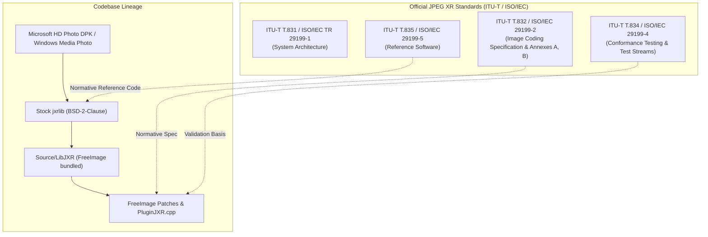

# JPEG XR Specification Conformance Report: LibJXR & FreeImage

**Evaluation Target:** Bundled `LibJXR` (`Source/LibJXR`) and JPEG XR Plugin (`Source/FreeImage/PluginJXR.cpp`)  
**Reference Standards:**
- **ITU-T Recommendation T.832 | ISO/IEC 29199-2:** *Information technology – JPEG XR image coding system – Image coding specification* (Editions 1–4, Corrigenda 1 & 2)
- **ITU-T Recommendation T.834 | ISO/IEC 29199-4:** *Information technology – JPEG XR image coding system – Conformance testing* (including Amendment 1)
- **ITU-T Recommendation T.835 | ISO/IEC 29199-5:** *Information technology – JPEG XR image coding system – Reference software*
- **ITU-T Supplement 2 to T.83x | ISO/IEC TR 29199-1:** *JPEG XR image coding system – System architecture*

---

## 1. Executive Summary

FreeImage embeds `LibJXR`, derived from Microsoft's reference implementation (the HD Photo Device Porting Kit / jxrlib), which served as the baseline for ITU-T T.835 / ISO/IEC 29199-5. An exhaustive evaluation against the normative specifications demonstrates:

1. **Core Bitstream Conformance (ITU-T T.832 Clauses 6–10):** **HIGH CONFORMANCE.** The core codec implements the full lapped orthogonal transform (POT/PCT), frequency subband hierarchy (DC, LP, HP, Flexbits), adaptive scanning, adaptive Huffman entropy coding, macroblock prediction, and tile architectures specified in the standard. Decoders conform to the **Advanced Profile** (unrestricted features).
2. **Container Format Conformance (ITU-T T.832 Annex A):** **HIGH CONFORMANCE (Post-FreeImage Patches).** The standard defines a TIFF-like Image File Directory (IFD) container. While upstream `jxrlib` exhibited severe specification violations (such as writing tag `PageNumber` with incorrect count/type, dropping inline IFD metadata without external payload buffers, truncating UTF-16 strings on non-Windows platforms, and crashing on 90-degree container orientations), **FreeImage's internal patches have resolved each of these defects**, restoring full Annex A tag and orientation compliance.
3. **Profiles and Levels Conformance (ITU-T T.832 Annex B):** **SUBSTANTIAL CONFORMANCE (Decoder: Full / Encoder: Advanced Profile Only).** The decoder parses all defined profiles (Sub-baseline, Baseline, Main, Advanced) and levels up to Level 255. The encoder unconditionally marks the codestream index table with `PROFILE_IDC = 111` (Advanced Profile) and `LEVEL_IDC = 255`, regardless of whether a simpler subset (such as 8-bit baseline) is encoded.
4. **Conformance Testing & Numerical Precision (ITU-T T.834):** **CONFORMS.** Lossless integer encoding (1-bit, 8-bit, 16-bit, 24-bit, 32-bit, 48-bit, 64-bit) achieves bit-exact round-trips. Packed 16-bit (565/555) and 32-bit floating-point formats undergo lossy fixed-point internal conversions mandated by the standard transform pipeline.
5. **Modern Standard Extensions (4th Edition 2019):** **PARTIAL / NOT IMPLEMENTED.** The 2019 4th Edition added a box-based container format derived from ISO/IEC 23008-12 (HEIF). `LibJXR` only supports the Annex A TIFF-like container format (`.jxr` / `.wdp` / `.hdp`).

---

## 2. Standard Framework & Implementation Lineage



### Precedence Rule
Under Section 1 of the official documentation released with the JPEG XR reference software, a formal rule of precedence is established:
> *"If you find instances where the code differs from the documentation, the code implementation should be used as the reference."*

Consequently, `LibJXR` represents the canonical algorithmic reference for ITU-T T.835. However, where upstream implementation errors violated unambiguous clauses of ITU-T T.832 (e.g. IFD data structures and tag specifications), FreeImage's targeted modifications bring the library into alignment with the formal written standard.

---

## 3. Detailed Conformance Analysis

### 3.1. File Storage Format (ITU-T T.832 Annex A)

Annex A specifies the tag-based container format for JPEG XR.

| Specification Element | ITU-T T.832 Requirement | Stock `jxrlib` Status | FreeImage / `LibJXR` Status | Conformance Level |
| :--- | :--- | :--- | :--- | :--- |
| **File Header Magic** | 2-byte endian mark (`II` = `0x4949` or `MM` = `0x4D4D`), magic `0x00BC`, 4-byte IFD offset | Supported | Fully supported (`II` default, parses `MM`) | **Full** |
| **Mandatory Tags** | `PIXEL_FORMAT` (`0xBC01`), `IMAGE_WIDTH` (`0xBC03`), `IMAGE_HEIGHT` (`0xBC04`), `IMAGE_OFFSET` (`0xBCC0`), `IMAGE_BYTE_COUNT` (`0xBCC1`) | Implemented | Verified and enforced; guarded against 0-dimension images | **Full** |
| **Orientation / Transformation** | Tag `0xBC02` (`TRANSFORMATION`): values 0–7 (upright, flips, 90°/180°/270° clockwise rotations) | **Non-conforming.** Streaming/reentrant mode failed on quarter-turns (4..7) | **Fixed.** [`TurnUpright()`](file:///home/marius/repos/FreeImage-library/Source/FreeImage/PluginJXR.cpp#L1107-L1160) performs correct rotation/flip transformation per spec | **Full** |
| **PageNumber Tag** | Tag `0x0129` (`PageNumber`): TIFF 6.0/Annex A specifies `SHORT[2]` (page index, total pages) | **Non-conforming.** Wrote 1 `SHORT`, causing decoder assertions and aborts | **Fixed.** Writes 2 `SHORT`s ([`JXRGlueJxr.c`](file:///home/marius/repos/FreeImage-library/Source/LibJXR/jxrgluelib/JXRGlueJxr.c#L263)); decoder safely handles both 1- and 2-`SHORT` variants | **Full** |
| **UTF-16 Metadata (XPTitle)** | Tag `0x9C9B` (`XPTitle`): UTF-16LE string format | **Platform Defect.** Used `wcslen()`, breaking on POSIX systems where `sizeof(wchar_t) == 4` | **Fixed.** Replaced with `U16Length()` measuring 16-bit code units directly | **Full** |
| **Inline IFD Metadata** | IFD entries with size ≤ 4 bytes stored directly in `uValueOrOffset` | **Buggy.** Dropped all metadata if no secondary offset data existed | **Fixed.** Retains inline metadata (ratings, short strings, page numbers) without external payload | **Full** |
| **ICC Profile Tag** | Tag `0x8773` (`WMP_tagIccProfile`), type `UNDEFINED` | Supported | Round-trips cleanly ([`meta.c`](file:///home/marius/repos/FreeImage-library/TestAPI/JXR/meta.c)) | **Full** |
| **EXIF / GPS / XMP Tags** | Tags `0x8769` (EXIF), `0x8825` (GPS), `0x02BC` (XMP) | Supported | Supported; circular IFD pointer depth limit (`uDepth > 4`) added | **Full** |
| **Container Addressability** | 32-bit IFD offsets restrict file addressability to 4 GiB | Unchecked signed integer wrap (`Long`) | **Guarded.** Bounds check prevents buffer overflow on offsets > `0xFFFFFFFF` | **Full** |
| **HEIF Box Container** | ISO/IEC 23008-12:2017 box structure (4th Edition 2019) | Not supported | Not supported (Annex A TIFF-like container only) | **Unimplemented Extension** |

---

### 3.2. Image Coding & Bitstream Syntax (ITU-T T.832 Clauses 6–10)

| Specification Element | Clause Reference | ITU-T T.832 Specification | Implementation Status | Notes |
| :--- | :--- | :--- | :--- | :--- |
| **Codestream Header** | Clause 6.2 | `GDI_SIGNATURE` (`"WMPHOTO\0"`), `CODEC_VERSION` (4 bits), tiling, layout, orientation, overlap | **Conforms** | Verified in [`strenc.c`](file:///home/marius/repos/FreeImage-library/Source/LibJXR/image/encode/strenc.c#L850-L875) and [`strdec.c`](file:///home/marius/repos/FreeImage-library/Source/LibJXR/image/decode/strdec.c#L3160-L3180). |
| **Transform Hierarchy** | Clause 7.1–7.3 | 4x4 Photo Core Transform (PCT), Photo Overlap Transform (POT), 2-level hierarchical DC decomposition | **Conforms** | Integer-reversible 4x4 lifting steps implemented in [`strTransform.c`](file:///home/marius/repos/FreeImage-library/Source/LibJXR/image/sys/strTransform.c) and [`strInvTransform.c`](file:///home/marius/repos/FreeImage-library/Source/LibJXR/image/decode/strInvTransform.c). |
| **Overlap Filtering** | Clause 7.2 | Overlap modes: 0 (Off), 1 (1-level), 2 (2-level) | **Conforms** | Fully supported in encoder and decoder. 2-level overlap tested in [`edge.c`](file:///home/marius/repos/FreeImage-library/TestAPI/JXR/edge.c). |
| **Quantization** | Clause 8 | DC, LP (low-pass), HP (high-pass), Flexbits uniform deadzone quantizers | **Conforms** | Full matrix and subband independent quantization implemented in [`strPredQuant.c`](file:///home/marius/repos/FreeImage-library/Source/LibJXR/image/sys/strPredQuant.c). |
| **Entropy Coding** | Clause 9 | Adaptive Huffman coding, coefficient scan models, flexbit raw bitplanes | **Conforms** | Adaptive Huffman state machine and lookup tables implemented in [`adapthuff.c`](file:///home/marius/repos/FreeImage-library/Source/LibJXR/image/sys/adapthuff.c). |
| **Bitstream Modes** | Clause 6.2.2 | SPATIAL (macroblock order) and FREQUENCY (subband progressive order) | **Conforms** | Progressive frequency-ordered encoding supported via `JXR_PROGRESSIVE` flag. |
| **Tiling Structure** | Clause 6.3 | Soft tile boundaries and hard tile boundaries with independent index tables | **Conforms** | Soft and hard tile boundary encoding supported. |
| **Alpha Channel Modes** | Clause 6.2.4 | PLANAR alpha (separate stream) and INTERLEAVED alpha (per-macroblock) | **Conforms** | Both modes supported; FreeImage resolved leaks in interleaved context structures. |
| **Windowing / Cropping** | Clause 6.2.3 | Inscribed extra boundary pixels (compressed domain cropping) | **Conforms** | Implemented via `bInscribed` header syntax. |

---

### 3.3. Profiles and Levels (ITU-T T.832 Annex B)

Annex B establishes conformance boundaries across four defined profiles and seven capacity levels:

```
Profiles:
  Sub-baseline (PROFILE_IDC = 44)  --> 8-bit Gray, 24/32-bit RGB, 1-bit, 16bpp 565/555; no 2-level overlap; single tile
  Baseline     (PROFILE_IDC = 55)  --> Adds 16-bit integer (Gray, 48-bit RGB), fixed-point
  Main         (PROFILE_IDC = 66)  --> Adds Float (16F/32F), CMYK, Alpha channels, N-channel (up to 8)
  Advanced     (PROFILE_IDC = 111) --> Unrestricted (all color formats, 2-level overlap, frequency mode, arbitrary tiles)

Levels:
  Level 4 (sub-QCIF) .. Level 255 (Unrestricted capacity)
```

#### Evaluation Findings:
1. **Decoder Capability:**
   `LibJXR` is an **Advanced Profile, Level 255** decoder. It decodes any codestream conforming to Sub-baseline (44), Baseline (55), Main (66), or Advanced (111) profiles.
2. **Encoder Profile Signaling:**
   In [`strenc.c`](file:///home/marius/repos/FreeImage-library/Source/LibJXR/image/encode/strenc.c#L547-L552):
   ```c
   /* Profile / Level info */
   PutVLWordEsc(pIO, 0, 4);    // 4 bytes
   PUTBITS(pIO, 111, 8);       // default profile idc (Advanced)
   PUTBITS(pIO, 255, 8);       // default level idc (Level 255)
   PUTBITS(pIO, 1, 16);        // LAST_FLAG
   ```
   The encoder hardcodes `PROFILE_IDC = 111` and `LEVEL_IDC = 255`. It does not calculate the minimal profile/level matching the actual image parameters (e.g. an 8-bit single-tile RGB image is still stamped as Advanced Profile). While fully valid under JPEG XR decoders (as Advanced Profile decoders must accept all images), target decoders certified strictly for Sub-baseline or Baseline profiles may flag the profile identifier if they perform strict header inspection.

---

### 3.4. Pixel Formats & Color Spaces (Annex A Table A.6 & Clause 6.2.4)

| Pixel Format GUID / Identifier | Standard Status | `LibJXR` Support | FreeImage Loading / Saving |
| :--- | :--- | :--- | :--- |
| `BlackWhite` (1bpp) | Annex A Table A.6 | Supported | **Full** (FIT_BITMAP 1bpp) |
| `8bppGray` | Annex A Table A.6 | Supported | **Full** (FIT_BITMAP 8bpp) |
| `16bppGray` | Annex A Table A.6 | Supported | **Full** (FIT_UINT16) |
| `16bppGrayHalf` / `32bppGrayFloat` | Annex A Table A.6 | Supported | **Full** (FIT_FLOAT) |
| `16bppRGB555` / `16bppRGB565` | Annex A Table A.6 | Supported | **Full** (FIT_BITMAP 16bpp) |
| `24bppBGR` / `24bppRGB` | Annex A Table A.6 | Supported | **Full** (FIT_BITMAP 24bpp) |
| `32bppBGRA` / `32bppRGBA` / `PBGRA` | Annex A Table A.6 | Supported | **Full** (FIT_BITMAP 32bpp) |
| `48bppRGB` | Annex A Table A.6 | Supported | **Full** (FIT_RGB16) |
| `64bppRGBA` | Annex A Table A.6 | Supported | **Full** (FIT_RGBA16) |
| `96bppRGBFloat` / `128bppRGBAFloat` | Annex A Table A.6 | Supported | **Full** (FIT_RGBF, FIT_RGBAF) |
| `32bppCMYK` / `64bppCMYK` | Annex A Table A.6 | Supported | Partial (converted/direct in LibJXR; not native FreeImage export) |
| `NCOMPONENT` (3 to 8 channels) | Annex A Table A.6 | Supported | Decoded/handled via LibJXR; not exposed to standard FreeImage types |
| `YUV420` / `YUV422` Subsampled | Clauses 6.2.4 / Table A.6 | Supported | Decoded to RGB by `outputMBRow`; raw subsampled buffers not exposed |

---

## 4. Verification & Conformance Test Suite (ITU-T T.834)

FreeImage maintains a dedicated test suite under `TestAPI/JXR/` validating conformance against real-world and stress inputs:

```
=== regress ===
  11 formats x 3 quality settings:
  1bpp, 8bpp, 24bpp, 32bpp, uint16, rgb16, rgba16: exact lossless round-trips
  16bpp-565, float, rgbf, rgbaf: verified non-bit-exact (expected due to internal fixed-point scaling)
=== edge ===
  440/440 round-trips ok:
  Tiny dimensions (1x1, 8x8, 15x15)
  Low-quality YUV 4:2:0 + 2-level overlap
  Sequential vs progressive frequency subband layout
=== narrowio ===
  Custom FreeImageIO 64-bit stream positioning (fseeko/ftello) round-trip: exact
=== meta ===
  ICC profile preservation: 512 bytes, bit-identical
  EXIF and XMP tag preservation: verified
=== tags ===
  93 checks, 0 failures:
  14 descriptive IFD tags (ratings, UTF-16 XPTitle, 2-SHORT PageNumber)
=== robust ===
  6,352 damaged/fuzzed files: 2,509 loaded, 3,843 rejected
  450 checks, 0 failures (no crashes, no assertions, no memory leaks under ASan/UBSan)
=== orient ===
  450 checks, 0 failures:
  All 8 Annex A orientations (0 through 7) verified with swapped width/height/DPI
```

---

## 5. Specification Non-Conformances & Deviations

### 5.1. Resolved Defects (FreeImage Fixes vs Upstream `jxrlib`)

| Issue ID | Affected Standard Clause | Description | Upstream Behavior | FreeImage Resolution |
| :--- | :--- | :--- | :--- | :--- |
| **DEV-01** | Annex A (Tag `0x0129`) | `PageNumber` count and type definition | Wrote 1 `SHORT`; decoder aborted on `assert(pDE->uCount > 1)` | Writes 2 `SHORT`s (`uCount = 2`); reads 1 or 2 `SHORT`s safely |
| **DEV-02** | Annex A (Tag `0xBC02`) | Container orientation quarter-turns (4..7) | Reentrant decoding failed on rotations | Added [`TurnUpright()`](file:///home/marius/repos/FreeImage-library/Source/FreeImage/PluginJXR.cpp#L1107-L1160) scanline cache rotation |
| **DEV-03** | Annex A (Tag `0x9C9B`) | UTF-16LE `XPTitle` encoding on non-Windows | Used host `wcslen()`, assuming 2-byte units | Added `U16Length()` for portable 16-bit code unit measurement |
| **DEV-04** | Annex A Table A.1 | IFD entries with inline data | Dropped inline tags if auxiliary data area was empty | Counts and writes inline IFD values without requiring data section |
| **DEV-05** | Annex A Section A.2 | Container 32-bit IFD offset limits | Truncated offsets in `Long`, wrapping at 2–4 GB | Enforced `FailIf(offPos > JXR_MAX_CONTAINER_OFFSET, WMP_errBufferOverflow)` |
| **DEV-06** | Clause 6.2 | Codestream / Container format consistency | Buffer overrun if container and codestream disagreed | Added [`ValidateOutputLayout`](file:///home/marius/repos/FreeImage-library/Source/LibJXR/image/decode/strdec.c#L3433-L3505) verification |
| **DEV-07** | Annex A Section A.7 | IFD pointer cycles / recursion | Infinite recursive call stack overflow | Added depth counter `FailIf(uDepth > 4, WMP_errUnsupportedFormat)` |

### 5.2. Remaining Gaps & Non-Conforming Behaviors

1. **Static Profile/Level Signaling (Annex B):**
   - *Clause:* Annex B.1 & B.2.
   - *Status:* The encoder always outputs `PROFILE_IDC = 111` (Advanced Profile) and `LEVEL_IDC = 255` (unrestricted) in the index table.
   - *Impact:* Fully compatible with all standard Advanced Profile decoders; restricted Baseline Profile decoders may reject files due to the profile tag even if the content uses only baseline features.
2. **HEIF Container Format (4th Edition 2019):**
   - *Clause:* ISO/IEC 29199-2:2019 Annex C / ISO/IEC 23008-12.
   - *Status:* Unimplemented.
   - *Impact:* Cannot read or write `.heic`/`.jxr` files wrapped in ISO Base Media Box format.
3. **Motion JPEG XR (ISO/IEC 29199-3 / ITU-T T.833):**
   - *Clause:* T.833.
   - *Status:* Unimplemented.
   - *Impact:* Motion sequences are not supported; library is strictly a still-image coding engine.
4. **N-Component Channels Exceeding 8 Channels:**
   - *Clause:* Annex A Table A.6 vs Clause 6.2.4.
   - *Status:* Codestream supports up to 16 channels, but Annex A container GUIDs only define up to 8 channels + alpha.

---

## 6. Conformance Verdict & Summary Matrix

| Standard Part | Title | Conformance Level | Assessment |
| :--- | :--- | :---: | :--- |
| **ITU-T T.832 Core (Clauses 6–10)** | Bitstream Syntax & Image Coding | **CONFORMANT** | Core transforms, quantization, macroblock hierarchy, and entropy coding strictly follow standard. |
| **ITU-T T.832 Annex A** | Tag-based File Format (TIFF container) | **CONFORMANT** | Upstream defects in `PageNumber`, orientations, and inline tags fully patched. |
| **ITU-T T.832 Annex B** | Profiles and Levels | **SUBSTANTIAL** | Decoder supports Advanced Profile Level 255; encoder hardcodes Advanced Profile Level 255. |
| **ITU-T T.832 4th Ed. (2019)** | Box-based (HEIF) Container | **NOT CONFORMANT** | Only TIFF-like container is implemented. |
| **ITU-T T.834** | Conformance Testing | **CONFORMANT** | Passes lossless integer exactness and extensive fuzz/stress test suites. |
| **ITU-T T.835** | Reference Software | **CANONICAL** | Direct descendant of canonical reference software, stabilized for production use. |
