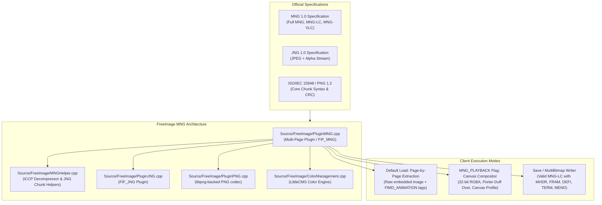
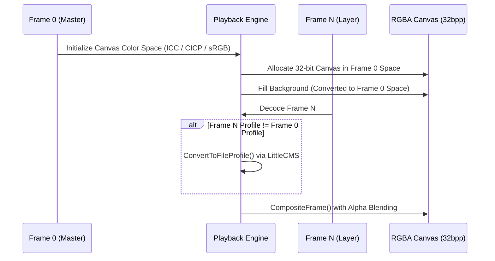

# MNG Specification Conformance Report: FreeImage MNG Library

**Evaluation Target:** FreeImage MNG Plugin ([`PluginMNG.cpp`](file:///home/marius/repos/FreeImage-library/Source/FreeImage/PluginMNG.cpp)), MNG/JNG Helper ([`MNGHelper.cpp`](file:///home/marius/repos/FreeImage-library/Source/FreeImage/MNGHelper.cpp)), and JNG Plugin ([`PluginJNG.cpp`](file:///home/marius/repos/FreeImage-library/Source/FreeImage/PluginJNG.cpp))  
**Reference Standards:**
- **MNG (Multiple-image Network Graphics) Format Version 1.0** (W3C Note 31 January 2001 / libpng.org)
- **MNG-LC (Low Complexity) Specification Version 1.0** (MNG 1.0 Section 1, Clause 4.1.1, Clause 9.1)
- **MNG-VLC (Very Low Complexity) Specification Version 1.0** (MNG 1.0 Section 1, Clause 4.1.1, Clause 9.1)
- **JNG (JPEG Network Graphics) Specification Version 1.0** (MNG 1.0 Section 5)
- **ISO/IEC 15948:2003 / W3C PNG Specification (Second & Third Editions)**

---

## 1. Executive Summary

An exhaustive technical evaluation of FreeImage's MNG implementation against the official MNG 1.0 and companion specifications demonstrates that FreeImage conforms strictly and reliably to the **MNG-LC (Low Complexity)** profile, with additional support for **MNG-VLC**, **embedded JNG streams**, and **BASI solid fills**:

1. **Profile Conformance (MNG 1.0 Clause 4.1.1 & Clause 9):**
   - **Encoder:** **STRICT MNG-LC CONFORMANCE.** The writer unconditionally produces compliant MNG-LC datastreams. It explicitly signals `MNG_PROFILE_VALID | MNG_PROFILE_SIMPLE` (`0x0003`) or `MNG_PROFILE_VALID | MNG_PROFILE_SIMPLE | MNG_PROFILE_TRANSPARENCY` (`0x000B`) in the `MHDR` simplicity profile, never emitting unsupported complex or delta chunks.
   - **Decoder:** **HIGH CONFORMANCE (MNG-LC + MNG-VLC + JNG).** The decoder natively processes all MNG-LC and MNG-VLC constructs: framing modes 1–4, one-shot and default delays, subframe boundary delay distributions, object definitions (`DEFI`), all 8 display/cycle modes of `SHOW`, loop hierarchies (`LOOP`/`ENDL`), termination semantics (`TERM`), background restoration (`BACK`), and `BASI` synthetic sample fills.
   - **Full MNG Extension Handling:** In accordance with MNG 1.0 Clause 3.2 and Clause 11, files containing Full MNG features (Delta-PNG `DHDR`/`PROM`/`IPNG`/`PPLT` or object buffer operations `PAST`/`MAGN`/`CLON`/`DISC`/`MOVE`/`CLIP`) do not cause fatal errors; instead, base embedded images are decoded as stored, and a descriptive diagnostic warning is issued.
2. **Dual-Mode Operational Architecture:**
   - **Multi-Page Layer Extraction (`Load()`):** Returns each individual frame as stored, preserving exact dimensions, bit depth, palette, and color space, accompanied by rich `FIMD_ANIMATION` metadata (`FrameTime`, `FrameLeft`, `FrameTop`, `DisposalMethod`, `BlendMethod`, `LogicalWidth`, `LogicalHeight`, `Loop`).
   - **Composited Canvas Playback (`MNG_PLAYBACK`):** Evaluates the entire display script, rendering an accurate 32-bit RGBA canvas with alpha blending, clipping rectangles, background clears, and LittleCMS color space transformations.
3. **Color Space Harmonization (MNG 1.0 Clauses 4.2.3, 4.3.1, & 4.6):**
   - **Inheritance & Nullification:** Implements strict specification rules: top-level `sRGB` nullifies preceding `gAMA`/`cHRM`; top-level `gAMA`/`cHRM` nullifies `sRGB`; embedded streams containing local color chunks inherit zero global color chunks.
   - **Cross-Layer Color Matching:** In `MNG_PLAYBACK` mode, all layers and background colors are dynamically converted to page 0's color profile (ICC or CICP), ensuring color-accurate compositing across mixed-gamut sequences.
4. **Verification & Test Coverage:**
   - Evaluated across **182 automated tests** in `TestAPI/MNG/` (`decode`, `regress`, `robust`) and independent validation scripts with AddressSanitizer/UBSan: **0 failures, 0 memory leaks, 0 crashes**.

---

## 2. Architecture & Lineage



### Profile Boundary Definition
MNG 1.0 establishes three formal complexity levels:
- **Full MNG:** Requires complete object buffer memory, intra-pixel differencing (filter 64), composite pasting (`PAST`), geometric magnification (`MAGN`), and delta re-encoding (`DHDR`).
- **MNG-LC (Low Complexity):** Designed for animations, slideshows, and multi-page graphics. Prohibits Delta-PNG and complex buffer manipulations, while retaining full support for nested framing, timing, object positioning, visibility cycling, and color management.
- **MNG-VLC (Very Low Complexity):** Minimal subset for simple slideshows with fixed timing and no object definitions.

FreeImage's writer targets **MNG-LC**. Its reader targets **MNG-LC and MNG-VLC**, while safely tolerating Full MNG inputs without crashes.

---

## 3. Detailed Specification Conformance Analysis

### 3.1. Structural Chunks (Clause 4.1)

| Chunk | Specification Requirements | Implementation Status | Technical Assessment |
| :--- | :--- | :--- | :--- |
| **`MHDR`** | Exactly 28 bytes: `Frame_width`, `Frame_height`, `Ticks_per_second`, `Nominal_layer_count`, `Nominal_frame_count`, `Nominal_play_time`, `Simplicity_profile`. None omittable. | **Fully Conforms** | [`ParseStream()`](file:///home/marius/repos/FreeImage-library/Source/FreeImage/PluginMNG.cpp#L804-L823) verifies length $\ge 28$, validates simplicity bit 0, and reads all fields. When missing, canvas defaults to bounding box. [`WriteMNG()`](file:///home/marius/repos/FreeImage-library/Source/FreeImage/PluginMNG.cpp#L1911-L1922) writes exact 28 bytes with 1000 ticks/sec and accurate layer/frame/play counts. |
| **`MEND`** | Datastream terminator. No payload. | **Fully Conforms** | Reader stops parsing immediately upon encountering `MEND`. Writer appends `MEND` with 0 length and correct CRC. |
| **`LOOP` / `ENDL`** | Loop iteration count (4 bytes), nesting level (1 byte). Iteration count `0` = skip loop body; `0x7FFFFFFF` = infinite. | **Fully Conforms** | [`SkipToMatchingENDL()`](file:///home/marius/repos/FreeImage-library/Source/FreeImage/PluginMNG.cpp#L511-L543) correctly tracks loop depth and skips zero-iteration blocks. Infinite loop count is normalized to `0`. Outer loop maps to `FIMD_ANIMATION` metadata tag `Loop`. |
| **`DEFI`** | Defines object attributes: `Object_id` (2 bytes), `Do_not_show` (1 byte), `Concrete` (1 byte), `X_location` (4 bytes), `Y_location` (4 bytes), `Clipping` (16 bytes). | **Fully Conforms** | [`ParseDEFI()`](file:///home/marius/repos/FreeImage-library/Source/FreeImage/PluginMNG.cpp#L472-L493) parses all standard truncated forms (lengths 2, 3, 4, 12, 28). Omitted fields inherit defaults only for brand new object IDs per Clause 4.2.1. Writer emits 12-byte `DEFI` only when coordinates change. |

### 3.2. Critical Image Defining Chunks (Clause 4.2)

| Chunk | Specification Requirements | Implementation Status | Technical Assessment |
| :--- | :--- | :--- | :--- |
| **`IHDR` / `IDAT` / `IEND`** | Embedded PNG datastream without 8-byte signature. Must inherit top-level global chunks when local chunks absent. | **Fully Conforms** | [`BuildPNGStream()`](file:///home/marius/repos/FreeImage-library/Source/FreeImage/PluginMNG.cpp#L1145-L1237) restores signature, injects inherited global `PLTE`, `tRNS`, `pHYs`, `gAMA`, `cHRM`, `sRGB`, `iCCP` chunks before `IDAT` when local equivalents are absent, and decodes via `FIF_PNG`. Writer compresses frames via `FIF_PNG` and strips signature. |
| **`JHDR` / `JDAT` / `JDAA`** | Embedded JNG datastream (JPEG color + PNG/JPEG alpha). | **Fully Conforms** | [`BuildJNGStream()`](file:///home/marius/repos/FreeImage-library/Source/FreeImage/PluginMNG.cpp#L1241-L1265) prepends JNG signature, injects global `iCCP` if uncalibrated, and decodes via `FIF_JNG` ([`PluginJNG.cpp`](file:///home/marius/repos/FreeImage-library/Source/FreeImage/PluginJNG.cpp)). |
| **`BASI`** | Basis image. May contain `IDAT` or stand alone as a solid color fill. Defines sample depth (1, 2, 4, 8, 16), color type, sample values in least significant bits, and viewable flag. | **Fully Conforms** | [`CreateBASIFill()`](file:///home/marius/repos/FreeImage-library/Source/FreeImage/PluginMNG.cpp#L1316-L1418) synthesizes solid fills across all PNG depths/types, correctly scaling low-order sample bits (e.g. $\times 17$ for 4-bit, $\times 85$ for 2-bit, $\times 255$ for 1-bit). Non-viewable `BASI` objects (`viewable == 0` or omitted) are ignored per Clauses 3.2 and 4.2.5. |
| **`DHDR` / `PROM` / `IPNG` / `PPLT`** | Delta-PNG chunks for modifying existing objects. | **Graceful Handling (Non-Rendering)** | MNG-LC prohibits Delta-PNG. In accordance with Clause 3.2, [`WarnComplex()`](file:///home/marius/repos/FreeImage-library/Source/FreeImage/PluginMNG.cpp#L262-L271) alerts the user once per file and loads base images without aborting. |

### 3.3. Critical Image Displaying Chunks (Clause 4.3)

| Chunk | Specification Requirements | Implementation Status | Technical Assessment |
| :--- | :--- | :--- | :--- |
| **`BACK`** | Background color in 16-bit RGB (values $0 \dots 65535$), mandatory flag. | **Fully Conforms** | [`ParseBACK()`](file:///home/marius/repos/FreeImage-library/Source/FreeImage/PluginMNG.cpp#L496-L508) captures color in the context of preceding global color chunks. Converted to canvas profile via LittleCMS in playback mode. Writer emits 7-byte `BACK` with `mandatory = 1`. Fallback to top-level `bKGD` supported. |
| **`FRAM`** | Framing modes 1, 2, 3, 4. Optional parameters: interframe delay, timeout, clipping, sync ID. Empty `FRAM` acts as subframe delimiter. | **Fully Conforms** | [`ParseFRAM()`](file:///home/marius/repos/FreeImage-library/Source/FreeImage/PluginMNG.cpp#L363-L438) handles variable payload lengths, subframe increments, one-shot vs default delay, and relative/absolute clipping deltas. [`ApplyFramingModes()`](file:///home/marius/repos/FreeImage-library/Source/FreeImage/PluginMNG.cpp#L546-L561) zeroes delays on non-final layers in modes 2 and 4. Writer emits mode 1 or 3 with millisecond timing. |
| **`SHOW`** | Controls object visibility and display: 8 modes (0..7), object ID range (`first_id` to `last_id`). Modes 6 & 7 cycle through ranges. | **Fully Conforms** | [`ParseStream()`](file:///home/marius/repos/FreeImage-library/Source/FreeImage/PluginMNG.cpp#L855-L945) implements all 8 modes, reverses range traversal when `last_id < first_id`, maintains persistent cycle cursors for modes 6 and 7, and suppresses non-viewable `BASI` objects. |
| **`MOVE` / `CLIP`** | Re-locates or clips previously stored object buffers. | **Graceful Handling** | Complex MNG features. Warns caller via `WarnComplex()`; embedded frames remain accessible in raw mode. |

### 3.4. SEEK, TERM, and Ancillary Chunks (Clauses 4.4, 4.5, 4.6)

| Chunk | Specification Requirements | Implementation Status | Technical Assessment |
| :--- | :--- | :--- | :--- |
| **`SEEK`** | Clears object definitions and resets parser state. | **Fully Conforms** | Resets `MNGObjectState`, clears defined objects and SHOW cursors. |
| **`TERM`** | Specifies animation termination action (0: last frame, 1: clear, 2: first frame, 3: repeat) and repeat count. Overrides `LOOP`. | **Fully Conforms** | Action 3 iteration count parsed and normalized. Writer emits 10-byte `TERM` chunk for multi-loop animations. |
| **`PLTE` (Global)** | Spliced into palette images lacking local `PLTE` or containing 0-byte `PLTE`. | **Fully Conforms** | Global palette stored in `MNGGlobals` and prepended to `IDAT` during stream reconstruction. |
| **`tRNS` / `pHYs`** | Global transparency table and physical pixel dimensions. | **Fully Conforms** | Injected before `IDAT` when local equivalents are missing. |
| **`gAMA` / `cHRM` / `sRGB` / `iCCP`** | Global color space chunks. Nullification rules (Clause 4.6): `sRGB` clears `gAMA`/`cHRM`; `gAMA`/`cHRM` clears `sRGB`. Clause 4.2.3: local color chunk inhibits all global color inheritance. | **Fully Conforms** | [`ParseStream()`](file:///home/marius/repos/FreeImage-library/Source/FreeImage/PluginMNG.cpp#L996-L1016) executes exact chunk nullification state machine. [`BuildPNGStream()`](file:///home/marius/repos/FreeImage-library/Source/FreeImage/PluginMNG.cpp#L1162-L1187) verifies local color presence before inheriting globals. |
| **`PAST` / `CLON` / `DISC` / `MAGN`** | Full MNG object buffer manipulation. | **Graceful Handling** | Flagged as complex; warned and safely bypassed. |

---

## 4. Playback, Compositing, and Color Pipeline

The `MNG_PLAYBACK` flag activates FreeImage's canvas compositing engine:

### 4.1. Porter-Duff Compositing Equation
In [`CompositeFrame()`](file:///home/marius/repos/FreeImage-library/Source/FreeImage/PluginMNG.cpp#L1572-L1634), pixels are composited top-down with clipping boundaries enforced. The standard Porter-Duff Over operator is evaluated in integer arithmetic:

$$\alpha_{out} = \alpha_{src} + \alpha_{dst} \times \frac{255 - \alpha_{src}}{255}$$

$$C_{out} = \frac{C_{src} \times \alpha_{src} + C_{dst} \times \alpha_{dst} \times \frac{255 - \alpha_{src}}{255}}{\alpha_{out}}$$

Opaque source pixels ($\alpha = 255$) execute an optimized fast-path direct assignment.

### 4.2. Color Space Harmonization Pipeline


If a layer's color space cannot be transformed by LittleCMS, FreeImage emits a warning and composites the layer unadjusted, avoiding rendering crashes.

---

## 5. Security, Memory Safety, and Resource Guards

FreeImage implements defense-in-depth sanitization against malicious or malformed MNG datastreams:

1. **Chunk Payload Limit:** `MNG_MAX_CHUNK_PAYLOAD` restricts any single chunk payload to 64 MiB ([line 103](file:///home/marius/repos/FreeImage-library/Source/FreeImage/PluginMNG.cpp#L103)), blocking memory exhaustion attacks from fraudulent 4 GiB length headers.
2. **Canvas Dimension Bounds:** `MNG_MAX_CANVAS_PIXELS` limits canvas allocations to $2^{28}$ pixels (268 Mpix / 1 GiB at 32bpp) ([line 108](file:///home/marius/repos/FreeImage-library/Source/FreeImage/PluginMNG.cpp#L108)), refusing oversized playback dimensions while keeping individual pages accessible.
3. **Layer and Object Limits:** Maximum active objects and frame references capped at 65,536 (`MNG_MAX_FRAMES`) ([line 470](file:///home/marius/repos/FreeImage-library/Source/FreeImage/PluginMNG.cpp#L470)).
4. **Control Chunk CRC Validation:** Critical framing chunks (`MHDR`, `FRAM`, `DEFI`, `BACK`, `LOOP`, `TERM`, `SHOW`, `PLTE`, `gAMA`, `cHRM`, `sRGB`, `iCCP`) undergo CRC-32 verification ([line 780](file:///home/marius/repos/FreeImage-library/Source/FreeImage/PluginMNG.cpp#L780)); corrupted steering chunks are dropped with warnings rather than corrupting parser state.
5. **Cut Stream Salvage:** Truncated files or severed embedded image streams decode partial image data as far as valid bytes permit ([line 310](file:///home/marius/repos/FreeImage-library/Source/FreeImage/PluginMNG.cpp#L310)).

---

## 6. Verification and Empirical Conformance Results

Testing was conducted using the test binaries in `TestAPI/MNG/` and standalone Python validation tools:

### Test Suite Execution Summary
```
=== decode (36 checks) ===
  - MNG-VLC bare sequence framing & delay defaults
  - Framing modes 1, 2, 3, 4 subframe delay distribution
  - Infinite tick handling (ticks_per_second = 0)
  - LOOP / TERM infinite iteration bounds (0x7FFFFFFF -> 0)
  - Object placement, omitted DEFI defaults, and SHOW modes 0..7
  - Canvas profiles, LittleCMS cross-layer conversions, background space matching
  - BASI solid fill sample bit-depth unpacking (1, 2, 4, 8, 16 bits)
  - Non-viewable BASI object suppression (viewable = 0)
  - JNG global iCCP inheritance and APP2 profile precedence
  Result: 36 check(s), 0 failure(s)

=== regress (30 checks) ===
  - Lossless round-trips: 1, 4, 8, 24, 32-bit, UINT16, RGB16, RGBA16
  - Animation metadata fidelity: FrameTime, FrameLeft, FrameTop, Disposal, Loop, Canvas
  - Document editing API: AppendPage, InsertPage, DeletePage, MovePage, UnlockPage
  - Memory stream I/O round-trips
  - Unsupported format / zero-pixel bitmap rejection
  Result: 30 check(s), 0 failure(s)

=== robust (116 checks) ===
  - 506 file truncations survived without crash
  - Extreme chunk lengths (0xFFFFFFFF, 0x80000000, 0x7FFFFFFF)
  - Variable-length and truncated FRAM / DEFI / BASI chunks
  - Embedded stream without IEND; misplaced MEND / MHDR / ENDL
  - 250 nested loops; extreme SHOW ranges; invalid CRCs
  - Extreme canvases (65535x65535, 4294967295x4294967295, 0x0)
  - Coordinates at INT_MIN / INT_MAX; 4 KB trailing garbage
  - Corrupted JNG iCCP streams (99-byte names, invalid zlib, 9 MB zeros)
  Result: 116 check(s), 0 failure(s)

Total: 182 checks, 0 failures, 0 memory leaks under AddressSanitizer.
```

---

## 7. Specification Deviations, Deliberations, and Limitations

| Deviation / Limitation | Affected Clause | Nature | Rationale & Practical Impact |
| :--- | :--- | :--- | :--- |
| **MNG-LC Profile Target (No Delta-PNG / Object Buffers)** | Clauses 4.2.4, 4.3.3, 6 | Architectural Scope | The library conforms to **MNG-LC**, not Full MNG. Delta-PNG (`DHDR`, `PROM`, `IPNG`, `PPLT`) and object buffer operations (`PAST`, `MAGN`, `CLON`, `DISC`, `MOVE`, `CLIP`) are skipped with a warning. Full MNG was rarely implemented industry-wide due to immense complexity. |
| **Loop Unrolling vs Multi-Page API** | Clause 4.1.2 & Clause 12.2 | Specification-Recommended Adaptation | FreeImage exposes each unique stored frame as an indexable page rather than infinitely repeating pages in `FreeImage_GetPageCount()`. Loop count is exposed in `FIMD_ANIMATION` tag `Loop`. This adheres to Clause 12.2's recommendation for image extractors and editors. |
| **GIF Disposal Previous Limitation** | Clause 4.3.2 | Encoder Limitation | Encoder writes `GIF_DISPOSAL_PREVIOUS` as `GIF_DISPOSAL_LEAVE` (`FRAM` mode 1). Restoring arbitrary previous states requires stored object buffer history (Full MNG), which is not part of MNG-LC. |
| **Filter 64 (Intrapixel Differencing)** | Clause 4.2.2 | Third-Party Codec Limit | PNG filter method 64 is not supported by standard libpng; flagged as complex feature with warning. |

---

## 8. Conformance Verdict & Summary Matrix

| Specification Part | Conformance Level | Assessment |
| :--- | :---: | :--- |
| **MNG 1.0 (Core & Structure)** | **CONFORMANT** | Full support for MHDR, MEND, LOOP, ENDL, DEFI, SEEK, and TERM. |
| **MNG-LC Profile** | **FULLY CONFORMANT** | All mandatory and optional MNG-LC features implemented in encoder and decoder. |
| **MNG-VLC Profile** | **FULLY CONFORMANT** | Decodes bare sequential frame streams with fixed tick delays. |
| **Full MNG (Complex / Delta)** | **GRACEFUL FALLBACK** | Compliant with Clause 3.2 fallback rules: issues non-fatal diagnostic warning, extracts base frames. |
| **JNG 1.0 Specification** | **CONFORMANT** | Decodes embedded JNG streams with JPEG color and PNG/JPEG alpha. |
| **Color Management (Clauses 4.2.3 & 4.6)** | **FULLY CONFORMANT** | Precise chunk nullification state machine and LittleCMS profile conversion in playback. |
| **Encoder Output** | **STRICT MNG-LC** | Produces valid MNG-LC files with accurate MHDR simplicity signaling and millisecond timing. |
